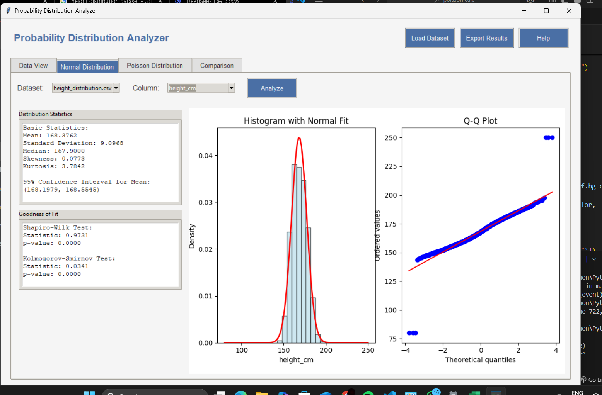

# 📊 Probability Distribution Analyzer

A desktop GUI application for analyzing probability distributions using **Normal** and **Poisson** models. Built entirely in Python with Tkinter, it provides statistical visualizations, distribution fitting, and goodness-of-fit testing — all from a clean and interactive interface.

---

## 🧰 Tech Stack

- Python
- Tkinter (GUI)
- Pandas
- NumPy
- Matplotlib
- SciPy

---

## ✨ Features

### ✅ Normal Distribution Analysis
- Interactive histogram with Normal distribution fit curve
- Q-Q plot to assess normality
- Summary statistics: mean, median, standard deviation, skewness, kurtosis
- 95% confidence interval for mean
- Shapiro-Wilk & Kolmogorov-Smirnov tests for normality

### ✅ Poisson Distribution Analysis
- Histogram with Poisson PMF overlay
- Comparison of empirical vs theoretical CDF
- Dispersion index (variance/mean)
- Chi-Square goodness-of-fit test

### ✅ Dataset Comparison
- Load and compare two datasets side-by-side
- Overlaid histogram comparison
- Dual empirical CDF plots
- Summary statistics for each dataset

---

## 📸 Screenshots

| Normal Distribution | Comparison View | Poisson Distribution |
|---------------------|-----------------|----------------------|
|  |  |  |

---

## 🏁 Getting Started

### 📦 Requirements
- Python 3.x
- Libraries:
  ```bash
  pip install pandas numpy matplotlib scipy
